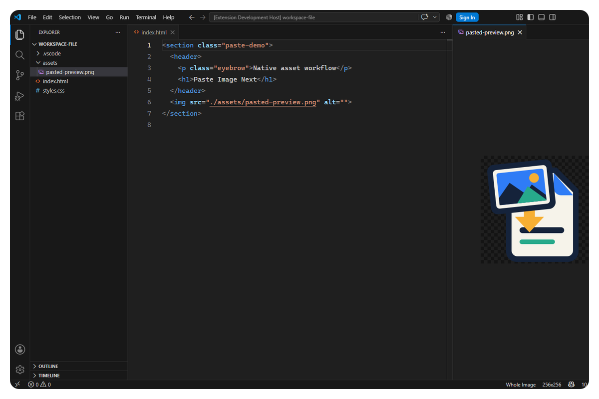

  

# Paste Image Next

**Paste a clipboard image into HTML, CSS, or MDX as a project asset.**

  
  
  

## Use it

1. Copy one PNG or JPEG image.
2. Open an HTML, CSS, SCSS, Less, or MDX file.
3. Use the normal VS Code **Paste** command.

Use **Paste As...** when you want to choose the file name, add alt text, paste Markdown syntax, or insert only the relative path.

| Editor language | Inserted reference |
| --- | --- |
| HTML | `` |
| CSS, SCSS, Less | `url("./assets/image.png")` |
| MDX | `` |
| Markdown | VS Code's built-in image paste wins by default |
| Other | **Paste As...** can insert the path |

The default destination is an `assets` folder beside the active document. Existing files are never overwritten; collisions become `image-2.png`, `image-3.png`, and so on.

## Settings

Paste Image Next uses the native VS Code Settings UI.

| Setting | Default | Purpose |
| --- | --- | --- |
| `pasteImageNext.destination` | `${documentDir}/assets` | Choose the asset directory |
| `pasteImageNext.filename` | `image-${date}-${time}` | Define the file-name template |
| `pasteImageNext.askForName` | `false` | Ask for a name after an edit is selected |
| `pasteImageNext.pathStyle` | `documentRelative` | Use document- or workspace-relative paths |
| `pasteImageNext.markdown.enabled` | `false` | Join normal Markdown paste while yielding to VS Code |
| `pasteImageNext.maximumFileSizeMiB` | `50` | Accept 1–100 MiB per image |

Destination tokens: `${documentDir}`, `${workspaceFolder}`, `${documentName}`.

Filename tokens: `${date}`, `${time}`, `${documentName}`, `${name}`, `${counter}`.

## Important behavior

- PNG and JPEG only. Bytes are preserved; there is no conversion or optimization.
- One image per paste.
- No network access, telemetry, clipboard polling, shell command, native helper, or temporary file.
- Markdown Ctrl+V remains VS Code's behavior unless you explicitly enable the Markdown setting.
- Untitled documents and read-only filesystems cannot receive an asset.
- Undo removes both the inserted reference and the created asset. Redo restores both, including later changes to that asset.

Desktop, browser, and writable virtual-workspace bundles are included. Windows is verified locally; Windows, macOS, Linux, minimum-version, web, and package checks run in CI. Remote Development and Codespaces must pass a packaged smoke test before they are advertised as verified.

## Development

Use pnpm. See [development](docs/development.md), [product contract](docs/PDR.md), and [publishing](docs/publishing.md).

---

  
  <a href="https://github.com/gvastethecreator"><picture><source media="(prefers-color-scheme: dark)" srcset="https://shieldcn.dev/badge/follow%20me-/gvastethecreator.png?size=xs&amp;logo=github&amp;brand=github&amp;mode=dark"></picture></a>
  <a href="https://github.com/sponsors/gvastethecreator"><picture><source media="(prefers-color-scheme: dark)" srcset="https://shieldcn.dev/badge/support%20this-project.png?size=xs&amp;logo=ri%3APiHeartFill&amp;logoColor=b85a90&amp;brand=github&amp;mode=dark"></picture></a>

